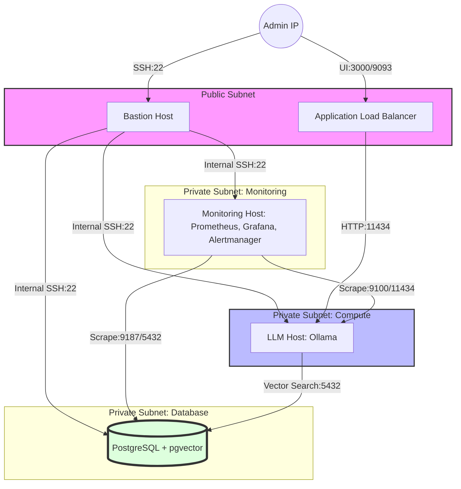

# AWS Infrastructure for LLM, Database & Monitoring with Terraform 

This repository contains Terraform code to deploy a production-ready infrastructure on AWS. It is designed to host an **LLM (Ollama)**, a **PostgreSQL (pgvector)** database, and a comprehensive monitoring stack (**Prometheus, Grafana, Alertmanager**).

## 🏗️ System Architecture

The following diagram illustrates the VPC logic and the secure traffic flow between components.

## 🛠️ Technology Stack

IaC: Terraform

Cloud: AWS (VPC, EC2, ALB, Security Groups)

Machine Learning: Ollama API (Port 11434)

Database: PostgreSQL with pgvector

Monitoring:

Prometheus: Metrics collection & time-series storage.

Grafana: Advanced visualization and dashboards.

Alertmanager: Incident management with Telegram notifications.

Blackbox & Node Exporters: External probing and system-level metrics.

## 📁 Project Structure
The project follows a modular approach for better maintainability:

modules/vpc: Network configuration, including public/private subnets and NAT gateways.

modules/security: Fine-grained Security Groups following the Principle of Least Privilege.

modules/compute: EC2 instance definitions and Cloud-init automation.

modules/compute/templates: Dynamic .tpl files for automated service configuration (Prometheus, Alertmanager).

## 🔒 Security & Connectivity
Bastion SG: Restricts SSH access strictly to the Administrator's IP.

LLM SG: Accepts traffic on port 11434 only from the ALB and the Monitoring host.

DB SG: Allows PostgreSQL connections exclusively from the LLM compute layer.

Monitoring SG: Limits access to Grafana (3000) and Prometheus (9090) to authorized IPs.

## 🏗️ Technical Architecture & Service Discovery
This project implements a dynamic monitoring ecosystem that automatically adapts to your AWS environment. ☁️

EC2 Service Discovery (SD): Prometheus 🔍 does not rely on static IP lists. It integrates directly with the AWS API to dynamically discover targets based on their metadata.

Tag-Based Filtering: I use a specific relabeling logic to ensure only the right instances are monitored. Prometheus only scrapes targets where:

The Monitoring tag is set to prometheus.

The ServiceType tag matches the expected exporter (e.g., node, postgres).

Grafana Auto-Provisioning: The entire Grafana 📊 setup is "Configuration as Code." Upon startup, it automatically:

Connects to the Prometheus Data Source.

Imports pre-defined JSON Dashboards for Linux and PostgreSQL.

IAM Security & Stability: The monitoring instance uses an IAM role with AmazonEC2ReadOnlyAccess to safely query AWS tags. The file permissions (chown 472:472) was granted to ensure the Grafana Docker container can reliably read its configuration from mounted volumes. 🛡️

## Monitoring & Metrics Overview
I use a multi-exporter approach to provide a 360-degree view of the infrastructure:

## 🚦 Getting Started
Clone the repository.

Configure terraform.tfvars with your specific variables (VPC IDs, Telegram Bot Token, Chat ID).
